# LinkedIn clone React App

<p align="center">
    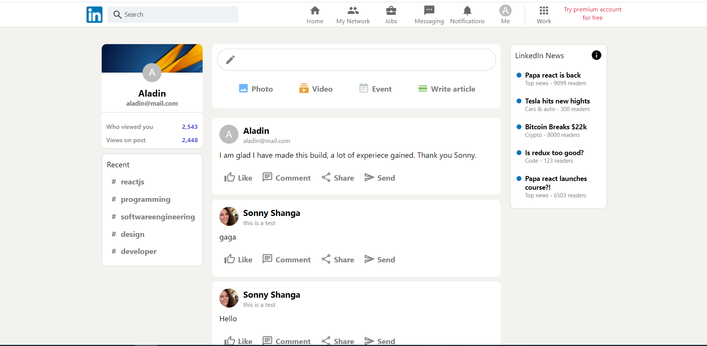
</p>

This project cosists of a **React** app ⚛️ Which has as a theme, *The LinkedIn Desktop Website*. The app makes the use of modern **Functional components** and **React hooks**. The project uses the **React Redux** for storing the user in the **Redux Store**. A very convenient way of accessing the state of the application for all of the components that need information about the user, from anywhere within the application, thus avoiding and eliminting the common and well known **prop drilling** issue present whithin the **React** *framework*. The project is deployed using **Google Firebase**, and it integrates the **CI/CD** pipeline for automatic inegration and automatic deployment to Firebase for ease of development. The deployment checks run when creating a pull request or when commiting directly to the *main* development branch. The project uses the **Google Firestore** Database that comes with the Firebase suite of features and services. The database is used to store the *posts* messages that a user can create and send within the application.

<br>

# Demo

The project is online:

<h3>

[LIVE DEMO HERE](https://linked-in-clone9.web.app/)

<br>

# Features

* Login functionality with Firebase Authentication services for easy account management 🔐
* The ablility to compose and post a message 💬
* Animations for loading the posts inside the feed and sending a post message 💫🏃
* Showing in real time the posts history ⏳🕛📚
* Sorting posts inside the feed from most recent to oldest
* Firestore database storage of posts

<br>

# Technologies used :
<br>
<h2> 

&nbsp;&nbsp;&nbsp;&nbsp;&nbsp;
* React  

&nbsp;&nbsp;&nbsp;&nbsp;&nbsp;
* React Redux  

&nbsp;&nbsp;&nbsp;&nbsp;&nbsp;&nbsp;&nbsp;
* Firebase Hosting  

&nbsp;&nbsp;&nbsp;&nbsp;&nbsp;&nbsp;&nbsp;
* Firebase Authentication  

&nbsp;&nbsp;&nbsp;&nbsp;&nbsp;
* Firestore Database &nbsp;&nbsp;&nbsp;

&nbsp;&nbsp;&nbsp;&nbsp;&nbsp;&nbsp;

* CI/CD pipeline &nbsp;&nbsp;&nbsp; 

&nbsp;&nbsp;&nbsp;&nbsp;&nbsp;&nbsp;

* Material UI &nbsp;&nbsp;&nbsp; 
</h1> 
</br>

## Log in page 
</br>
<p align="center">
    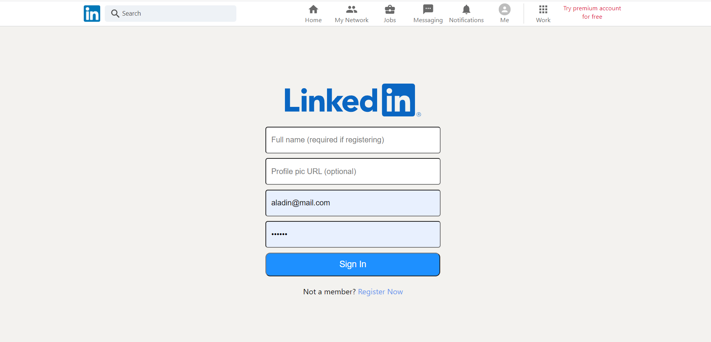
</p>

<br>

# CI/CD

The rules for the CI/CD pipeline are present in a github workflows folder inside of the project. The rules are contained inside of two files used by firebase when commiting to the main branch and creating a pull request to the main branch: `firebase-hosting-pull-request.yml` and `firebase-hosting-merge.yml`. 

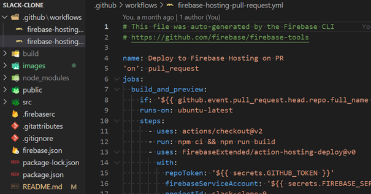
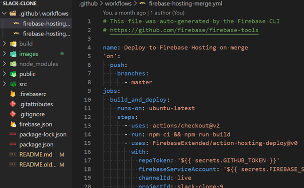

<br>
<br>

Using these rules, as seen in the image below, whenever a commit or a merge commit is made to the main branch, **Firebase** triggers these rules and starts the deployment process. The progress can be seen in the **GitHub Actions** tab inside of the respective repository.

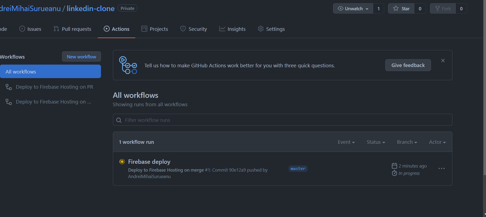

<br>
<br>

After clicking on **Firebase deploy** information is revealed about the commit that triggered the deployment.

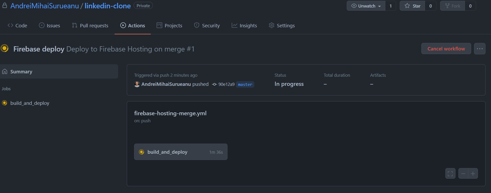

<br>
<br>

Clicking on **build_and_deploy** opens the deployment log where we have the ability to check information about the staus of the deployment and check the errors of the build if the deployment was unsuccessful

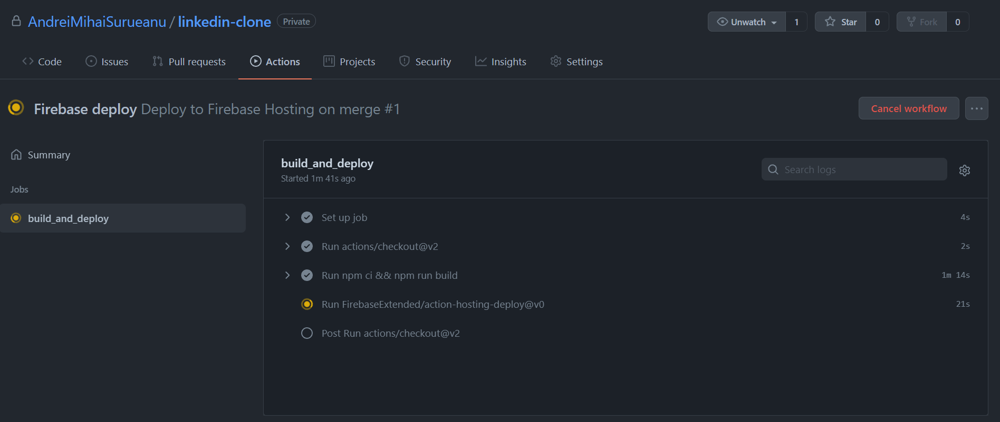
<br>
<br>
<br>

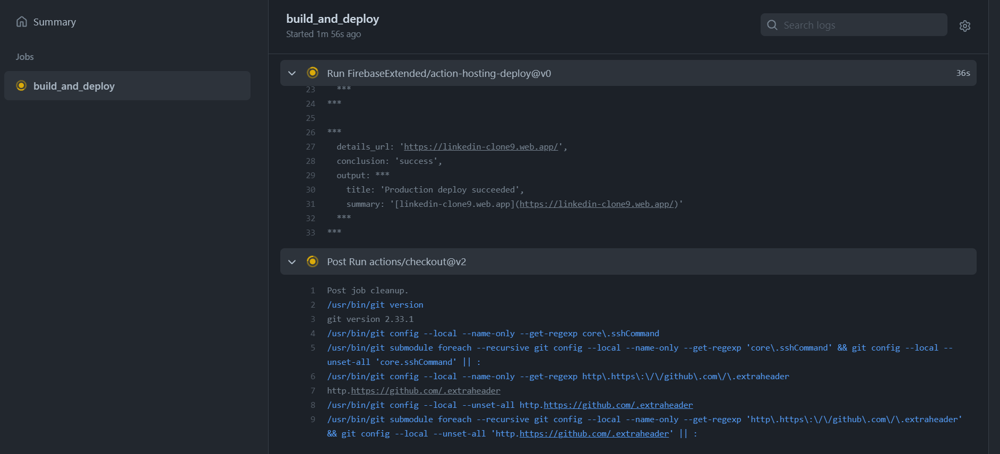
<br>
<br>

The deployment was successful and now the website is *live*

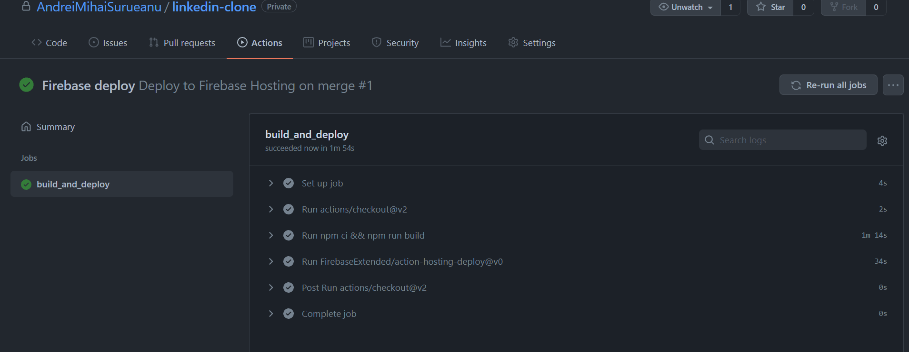
<br>
<br>

 Now when creating a pull request to the main branch or when commiting directly on the main branch, the automatic deployment rules execute and run the checks for the new build.

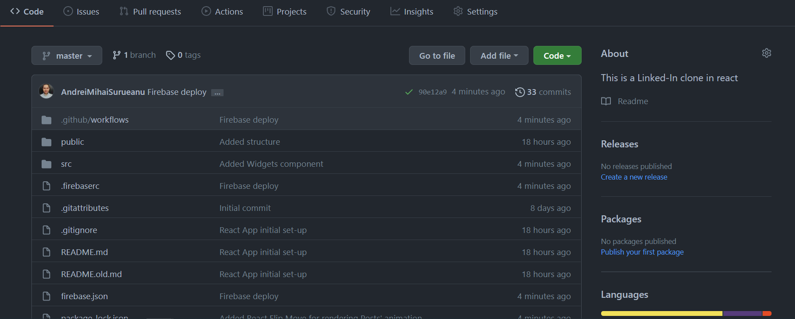
<br>
<br>
<br>

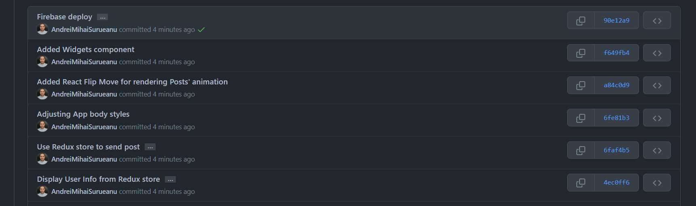
<br>
<br>
<br>

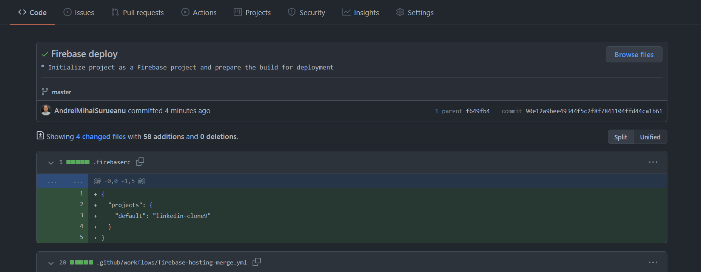
<br>
<br>
<br>


# To run the project locally

## Pre-requisites:
- node installed (e.g. version used: v14.15.1)
- npm installed (e.g. version used: 6.14.8)

## Steps:

1. Clone the repository
2. Open the command line in the project folder.
3. From the command line write the following comands in order:
```
npm i
npm start
```
4. If port 3000 is not in use, then the React app will start at:
- http://localhost:3000

### Have fun with project and thank you for your attention. 😊 😉
